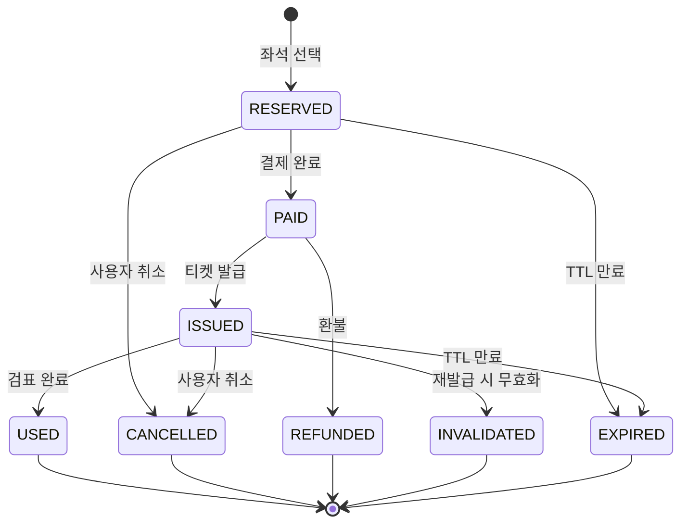

# 티켓 상태 전이 다이어그램

---

# 티켓 상태 전이 표

| 현재 상태       | 전이 이벤트   | 다음 상태       | 비고            |
|-------------| ------------- |-------------| --------------- |
| RESERVED    | 결제 완료     | PAID        | 정상 결제        |
| RESERVED    | TTL 만료      | EXPIRED     | **자동 해제**    |
| RESERVED    | 사용자 취소   | CANCELLED   | 공연 전까지만    |
| PAID        | 티켓 발급     | ISSUED      | **QR 생성**      |
| PAID        | 환불          | REFUNDED    | 결제 취소        |
| ISSUED      | 검표          | USED        | 공연 입장        |
| ISSUED      | 사용자 취소   | CANCELLED   | 공연 전까지만    |
| ISSUED      | 재발급        | INVALIDATED | 기존 QR 무효     |
|   ISSUED | TTL 만료 | EXPIRED | 공연 시간 경과 |
| USED        | -             | [종료]        | 더 이상 전이 없음 |
| CANCELLED   | -             | [종료]        | Dead state      |
| REFUNDED    | -             | [종료]        | Dead state      |
| INVALIDATED | -             | [종료]        | Dead state      |
| EXPIRED     | -             | [종료]        | Dead state      |
